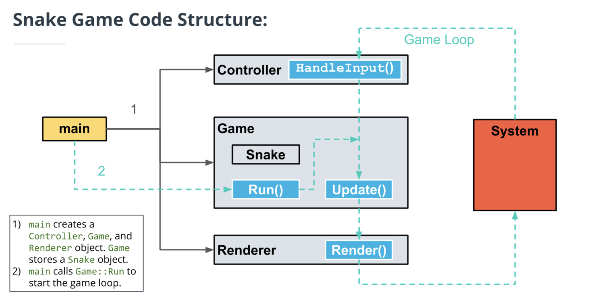
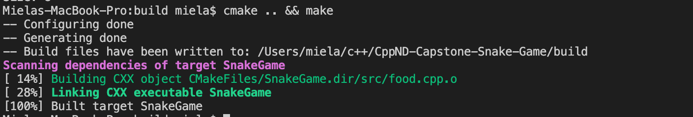

#Snake Game

## Project description
This is a simple snake game, the aim is snake eats green food, when he eats it, he gets more engery and move faster.
The red color is a poison and if snake eats it, a snake will die. 

## Class structure

## Rubric points are addressed
* The submission must compile and run.

* Loops, Functions, I/O
  * created FoodType, also there is switch in food.h
  * I/O score is saved by save.cpp in FILE.txt
* Object Oriented Programming 
* Memory Management
* Concurrency
  * yes please check src/main.cpp src/game.cpp src/controller.cpp src/renderer.cpp src/snake.cpp  src/food.cpp src/save.cpp

## Dependencies for Running Locally
* cmake >= 3.7
  * All OSes: [click here for installation instructions](https://cmake.org/install/)
* make >= 4.1 (Linux, Mac), 3.81 (Windows)
  * Linux: make is installed by default on most Linux distros
  * Mac: [install Xcode command line tools to get make](https://developer.apple.com/xcode/features/)
  * Windows: [Click here for installation instructions](http://gnuwin32.sourceforge.net/packages/make.htm)
* SDL2 >= 2.0
  * All installation instructions can be found [here](https://wiki.libsdl.org/Installation)
  * Note that for Linux, an `apt` or `apt-get` installation is preferred to building from source.
* gcc/g++ >= 5.4
  * Linux: gcc / g++ is installed by default on most Linux distros
  * Mac: same deal as make - [install Xcode command line tools](https://developer.apple.com/xcode/features/)
  * Windows: recommend using [MinGW](http://www.mingw.org/)

## Basic Build Instructions

1. Clone this repo.
2. Make a build directory in the top level directory: `mkdir build && cd build`
3. Compile: `cmake .. && make`
4. Run it: `./SnakeGame`.